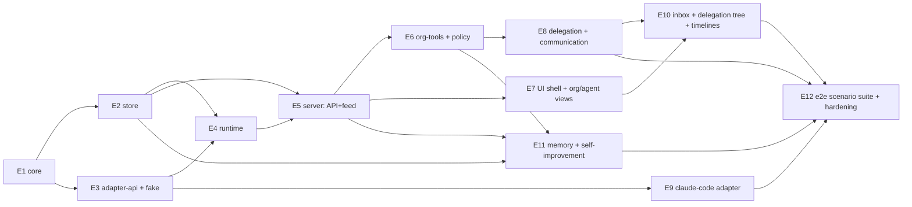

# Implementation Roadmap — Epics, Stories, Tasks, Dependency Graph, Order

## How to read this

- **Epics (E1–E12)** decompose into stories; stories into tasks small enough for an implementation agent.
- Every story lists **acceptance criteria (AC)** that are runnable — an implementing agent can verify its own work (the fake adapter and the conformance/contract suites exist for exactly this).
- **⚠ KEYSTONE** marks work that is *not* suitable for a small-model agent (challenge C9): it sets a contract others build on. Assign to a senior agent or human; everything unmarked is deliberately Haiku-sized.
- Contracts referenced are in [contracts.md](contracts.md); design in `../architecture/`.

## Dependency graph

**Parallelism:** after E1 freezes the schemas (about a week of keystone work), four lanes proceed independently: **store lane** (E2→E4), **adapter lane** (E3→E9), **server lane** (E5→E6→E8), **UI lane** (E7→E10, against fixture projections from day one). E11 is a fifth, small lane. E12 converges everything.

**Order of value:** the first end-to-end moment ("create agent → message it → watch fake run → see timeline") lands after E1–E5 + minimal E7; the first *real* moment (same, with Claude Code) needs only E9 added. Delegation (E8) then turns a tool into an organisation.

---

## E1 — Domain core (`@ade/core`) ⚠ KEYSTONE (whole epic)

The contract everyone else builds against. Freeze before fan-out.

| Story | AC |
|---|---|
| **E1.1** Entity types + Zod schemas for all doc-02 entities | Schemas round-trip (`parse(serialize(x)) = x`); JSON Schema generation works; exhaustive fixtures for every entity |
| **E1.2** State-machine transition tables (agent, workstream, run, task, message-disposition) | `canTransition` matches doc-02 exactly; property test: no invalid transition reachable; every transition names its emitting event type |
| **E1.3** Event catalogue v1 (~40 types + payload schemas + version) | Every doc-02/04 state change has an event type; catalogue doc auto-generated from schemas; unknown-type tolerance helper for consumers |
| **E1.4** Org-tool + API DTO schemas, error codes | All contracts.md shapes present; policy error codes enumerated; MCP tool schemas derive from the same Zod definitions |
| **E1.5** ULID ids, ref types (`artifact:`, `workstream:`, …) | Parse/format round-trip; sortability test |

## E2 — Store (`@ade/store`)

| Story | AC |
|---|---|
| **E2.1** SQLite bootstrap + migration runner | Fresh dir → current schema; re-run idempotent; version recorded |
| **E2.2** ⚠ `mutate()` atomic (change+events) helper | Kill-mid-transaction test: neither state nor event persisted; events get monotonic `seq`; no other write path exists (lint rule) |
| **E2.3** Entity queries (CRUD reads per entity, task `tree()`) | Fixture-based query tests incl. 10k-row perf sanity |
| **E2.4** Event feed: `after(seq)`, in-process `subscribe`, filters | Replay-after-reconnect test: no gaps, no dupes |
| **E2.5** Projections: orgView, agentPage, inbox, timeline, delegationTree, costRollup | Each projection has fixture→snapshot tests; **agent status derivation matches the doc-02 precedence table case by case** |
| **E2.6** Run-delta compaction → transcript file | Post-compaction: timeline still renders from transcript; table rows pruned; audit fields retained |
| **E2.7** Artifact store (content-addressed) + `ade backup` | sha256 verify on read; backup/restore round-trip test |

## E3 — Adapter contract + fake engine

| Story | AC |
|---|---|
| **E3.1** ⚠ `adapter-api`: interfaces, `EngineEvent`, `CapabilitySet` | Types compile against core; documented per contracts.md |
| **E3.2** ⚠ Conformance suite `describeAdapterContract` | Covers lifecycle, cancel, event ordering, exactly-one `run_ended`, capability honesty |
| **E3.3** Fake adapter: scenario-file driven (emit events, sleep, hang, crash, call org-tools, burn simulated usage) | Passes conformance; scenario DSL documented; ships ≥12 canned scenarios incl. every doc-07 failure mode it can express |

## E4 — Runtime (`@ade/runtime`)

| Story | AC |
|---|---|
| **E4.1** Run queue: enqueue, per-workstream serialization, concurrency caps, human-first priority | Test: 3 jobs on one workstream execute strictly serially; caps honoured under load; queueing emits events |
| **E4.2** Run supervisor: adapter invocation, event persistence, terminal folding | Fake scenario "happy path" ⇒ run rows, events, workstream state all correct |
| **E4.3** Watchdogs: wall-clock, stall, budget cutoff on `usage_delta` | Fake "hang" ⇒ interrupted at stall cap with events; fake "burn" ⇒ cut at budget with `budget_exhausted` |
| **E4.4** Workspace manager: worktree create/acquire/release, dirty-check (F8), plain dirs | Two workstreams on one repo get isolated worktrees; dirty worktree ⇒ run refused + workstream blocked |
| **E4.5** ⚠ Startup reconciliation + pid sweep (F3, F7) | Kill control plane mid-fake-run; restart ⇒ run `interrupted`, orphan killed, queued work requeued — doc-01 success test #1 automated |
| **E4.6** Resume flow (engine `resume` capability) | Interrupted fake run auto-resumes once with sessionRef; second failure ⇒ degraded + inbox event |

## E5 — Control-plane server: API + feed

| Story | AC |
|---|---|
| **E5.1** Server skeleton: startup orchestration (migrate → reconcile → listen), config, problem+json errors | Boots on empty dir; health endpoint; malformed body ⇒ 400 problem+json with core-schema details |
| **E5.2** Agent CRUD + lifecycle commands (suspend/resume/retire incl. retire-blocked-while-open-tasks) | API tests per doc-02 lifecycle rules; all emit correct events |
| **E5.3** Workstream commands: create, human message (→ enqueue run), redirect, close | Human message on idle workstream schedules a fake run end-to-end |
| **E5.4** Query endpoints = store projections 1:1 | Contract tests: response shapes match core DTOs |
| **E5.5** SSE event feed with `after` replay | Disconnect/reconnect test: zero gap, zero dupe (F13) |
| **E5.6** ⚠ Context composition (fixed section order, `input_context_ref` recorded, memory index inclusion) | Composed file matches golden fixtures per trigger type; recorded per run |
| **E5.7** `ade` CLI: init, daemon start/stop, agent create, backup | Smoke test on fresh machine path |

## E6 — Org-tools + policy engine

| Story | AC |
|---|---|
| **E6.1** ⚠ Per-run scoped tokens (mint at start, expire at end) | Expired/foreign token ⇒ 401; events attribute to correct (agent, run) |
| **E6.2** Org-tools MCP server + CLI shim exposing contracts.md toolset | Tool schemas auto-derived from core; fake adapter can call every tool; shim parity test |
| **E6.3** Policy engine: org→team→agent chain; budgets, depth, comms permissions, approval kinds | Table-driven tests per doc-07 policy matrix; rejection codes machine-readable |
| **E6.4** Approvals: request → inbox item → grant/deny → run re-trigger; engine `permission_request` mapping | Fake scenario: run requests approval, ends `awaiting_input`; grant ⇒ next run scheduled with decision in context |

## E7 — UI shell + first views

UI lane starts against fixture projections (from E2.5 snapshots) — no live server needed until integration.

| Story | AC |
|---|---|
| **E7.1** SPA shell: left-rail org navigation, routing, SSE client with replay, TanStack Query wiring | Reconnect resilience test; agents-as-navigation per doc-06 |
| **E7.2** Org view: teams, status badges, exception-first collapse, "currently:" lines, burn sparklines | Renders 200-agent fixture without jank; badge precedence matches doc-02 |
| **E7.3** Agent page: charter (edit+versions), status w/ explanation link, workstreams, dispositions, relationships, engine grade | All sections from fixtures; charter edit round-trips via API |
| **E7.4** Workstream view: run timeline (collapsed cards → event stream), capability-degraded rendering, artifact/diff view, redirect composer | Timeline renders full-capability and text-only fixtures correctly (ADR-003 degradation visible) |

## E8 — Delegation + communication

| Story | AC |
|---|---|
| **E8.1** Task lifecycle end-to-end: delegate (tool+API) → workstream spawn → run trigger → deliver → accept/reject → rejection loop cap → escalate | Fake two-agent scenario: A delegates to B, B delivers, A accepts — every doc-04 state and event asserted |
| **E8.2** Budget conservation + depth caps (structural) | Property test on random trees: Σchildren ≤ parent at every node always; over-budget/over-depth `delegate_task` ⇒ correct code inside the run |
| **E8.3** Typed messages + dispositions + expiry sweep | Unanswered question expires ⇒ inbox item; answer ⇒ asker's run scheduled with answer in context |
| **E8.4** Threads + round caps + auto-escalation (F5) | Fake ping-pong scenario escalates at cap |
| **E8.5** Routing (team/role → deterministic resolution, recorded; failure → inbox) | Doc-02 routing rules table-tested; F11 path covered |
| **E8.6** Cancellation cascade + handover | Cancel mid-tree ⇒ subtree cancelled, runs stopped, all parties notified (events); handover re-parents with structured summary enforced |

## E9 — Claude Code adapter

| Story | AC |
|---|---|
| **E9.1** ⚠ Headless spawn + stream-json → `EngineEvent` mapping + session capture | Conformance suite green on recorded fixtures; fixture-refresh procedure documented |
| **E9.2** Org-tools MCP injection via generated config | Recorded fixture proves a real `delegate_task` tool call lands in ADE |
| **E9.3** Resume, cancel, usage mapping | `--resume` round-trip on fixtures; usage totals match fixture payloads |
| **E9.4** Permission hooks → ADE approvals | Engine permission prompt fixture ⇒ approval item ⇒ grant flows back |
| **E9.5** Nightly live-CLI lane (manual trigger, spend-capped) | One real happy-path run green against installed CLI |

## E10 — Inbox, delegation tree, cost

| Story | AC |
|---|---|
| **E10.1** Inbox view: ranked items, inline actions (answer/grant/accept/reject/reassign) | Every doc-06 inbox item type renders with working action; severity-then-age ordering tested |
| **E10.2** Delegation tree view: statuses, spend/budget meters, ages, escalation-path highlight, node actions | Renders E8 fixture trees; cancel/raise-budget round-trip |
| **E10.3** Cost surfaces: meters + rollups (run→org), unreported-capability display | Rollups match costRollup projection; degraded engines show "unreported" |
| **E10.4** Anomaly rules (budget %, crash loop, cap hits) → inbox | Each rule has a fake-scenario test producing exactly one inbox item |

## E11 — Memory & self-improvement (ADR-007, ADR-012)

| Story | AC |
|---|---|
| **E11.1** Memory dirs: layout, INDEX.md convention, git auto-commit after touching runs | Commit appears post-run; human edit + agent edit coexist (merge-free append discipline documented) |
| **E11.2** Composition inclusion (memory + skills indexes, paths, provenance labels, standing instructions incl. curation nudges) | Golden-fixture contexts include labelled memory/skills sections; agent instructed on curation per doc-05 |
| **E11.3** Workstream-close distillation prompt (facts *and* procedures) | Closing run's context includes distillation instruction; memory browsable/editable in agent page (extends E7.3) |
| **E11.4** Skills dirs: `SKILL.md` (agentskills.io) layout, git versioning, claude-code native wiring, index fallback for other engines | Skill created in a fake run appears in agent page + next run's context; claude-code adapter test proves native skill load (extends E9 fixtures) |
| **E11.5** FTS5 index (transcripts, run results, messages, goals) + `search_history` org-tool, policy-scoped | Index updated on run end/message write; fake scenario: agent finds a prior workstream's solution via `search_history`; scope enforcement tested per policy matrix |

## E12 — End-to-end scenarios + hardening (release gate)

| Story | AC |
|---|---|
| **E12.1** Charter scenario suite: the six doc-01 success tests, automated against the full stack (fake adapter) | All six green in CI |
| **E12.2** Failure-mode suite: every doc-07 F# with an expressible fake scenario | All green; each failure produces its inbox item and complete event trail |
| **E12.3** Multi-level org scenario: 3 teams, 8 agents, human delegates root → 3-level tree → delivery chain → root acceptance | Delegation tree view, inbox, and cost rollups all correct at each stage |
| **E12.4** Docs: install/quickstart, "create your first specialist", adapter-author guide | A new machine reaches first-real-run following the quickstart alone |
| **E12.5** Dogfood: run ADE's own remaining backlog through ADE with 2–3 specialists | One week of real use; every "I missed something important" filed as P1 (Risk 3) |

---

## Suggested phase cut

- **Phase 0 (keystones, senior/human):** E1, E3.1–E3.2, E2.2, E4.5, E5.6, E6.1, E9.1 designs reviewed together — they are one coherent contract set.
- **Phase 1 (first light):** E2, E3.3, E4, E5, E7.1–E7.2 → *fake agent runs visibly*.
- **Phase 2 (real + organised):** E6, E9, E7.3–E7.4, E8 → *real engine + delegation*.
- **Phase 3 (supervisable):** E10, E11, E12 → *the charter demo: open the app in the morning and lead the org*.

Second engine adapter (Codex CLI — proves ADR-003 for real) is deliberately scheduled *post-v1 but pre-1.0*, once E12.5 dogfood has validated the contract worth freezing.
